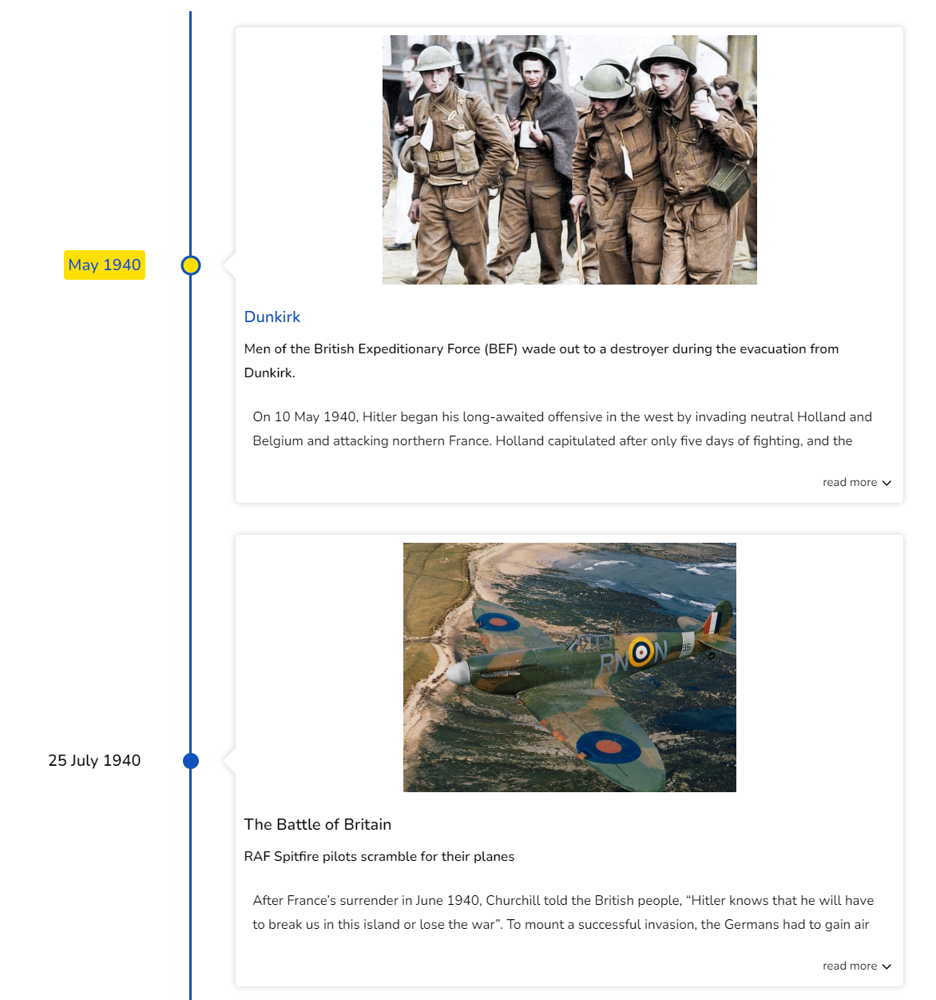
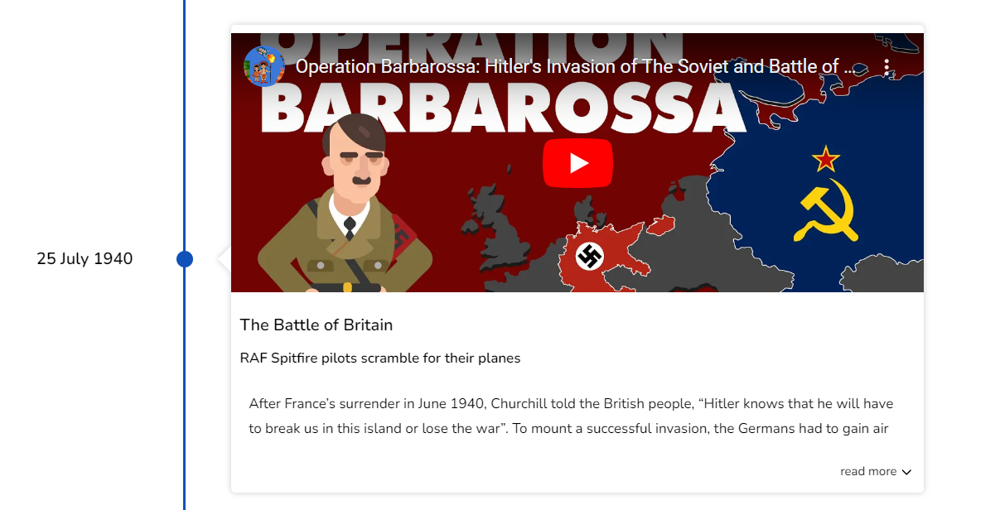

# Embedding Media

Media resources such as images, video files and youtube urls can be embedded using the `media` property of the Timeline object.

| name   | description                          |
| :----- | :----------------------------------- |
| name   | name of the media                    |
| source | Object that defines the media source |
| type   | typ of Media                         |

## Embedding Images

To embed images in the Timeline card, pass a valid image url to the `media` object. The following example builds a simple timeline with 2 cards.

Specify the image `URL` in the `source` property of the `media` object, and you will be good to go.

```jsx
<Chrono
  items={[
  {
    title: "May 1940",
    cardTitle: "Dunkirk",
    media: {
      name: "dunkirk beach",
      source: {
        url:
          "https://i2-prod.mirror.co.uk/incoming/article10847802.ece/ALTERNATES/s810/PAY-Dunkirk-in-colour.jpg"
      },
      type: "IMAGE"
    },
    cardSubtitle:
      "Men of the British Expeditionary Force (BEF) wade out to a destroyer during the evacuation from Dunkirk.",
    cardDetailedText: `On 10 May 1940, Hitler began his long-awaited offensive in the west by invading neutral Holland and Belgium and attacking northern France. Holland capitulated after only five days of fighting, and the Belgians surrendered on 28 May. With the success of the German ‘Blitzkrieg’, the British Expeditionary Force and French troops were in danger of being cut off and destroyed.`
  },
  {
    title: "25 July 1940",
    cardTitle: "The Battle of Britain",
    media: {
      name: "Battle of britain",
      source: {
        url:
          "https://thumbs-prod.si-cdn.com/NbOmrVrVAO-uSo0O8kVNdpqVyCk=/800x600/filters:no_upscale()/https://public-media.si-cdn.com/filer/c6/b0/c6b0f904-ae9c-47e5-86a9-493dfaefd43c/spitfire_1.jpg"
      },
      type: "IMAGE"
    },
    cardSubtitle: `RAF Spitfire pilots scramble for their planes`,
    cardDetailedText: `After France’s surrender in June 1940, Churchill told the British people, “Hitler knows that he will have to break us in this island or lose the war”. To mount a successful invasion, the Germans had to gain air superiority. The first phase of the battle began on 10 July with Luftwaffe attacks on shipping in the Channel.
      The following month, RAF Fighter Command airfields and aircraft factories came under attack. Under the dynamic direction of Lord Beaverbrook, production of Spitfire and Hurricane fighters increased, and despite its losses in pilots and planes, the RAF was never as seriously weakened as the Germans supposed.`
  }]}
  mode="VERTICAL"
/>
```



## Embedding Video

`react-chrono` allows you to embed either valid YouTube urls or local video files. The example that follows demonstrates how to add YouTube videos to timeline cards.

```jsx
<Chrono
  items={[
    {
      title: "25 July 1940",
      cardTitle: "The Battle of Britain",
      media: {
        name: "Battle of britain",
        source: {
          url: "https://www.youtube.com/embed/gPMgYC0sXos"
        },
        type: "VIDEO"
      },
      cardSubtitle: `RAF Spitfire pilots scramble for their planes`,
      cardDetailedText: `After France’s surrender in June 1940, Churchill told the British people, “Hitler knows that he will have to break us in this island or lose the war”. To mount a successful invasion, the Germans had to gain air superiority. The first phase of the battle began on 10 July with Luftwaffe attacks on shipping in the Channel.
        The following month, RAF Fighter Command airfields and aircraft factories came under attack. Under the dynamic direction of Lord Beaverbrook, production of Spitfire and Hurricane fighters increased, and despite its losses in pilots and planes, the RAF was never as seriously weakened as the Germans supposed.`
    }
  ]}
  mode="VERTICAL"
/>
```


